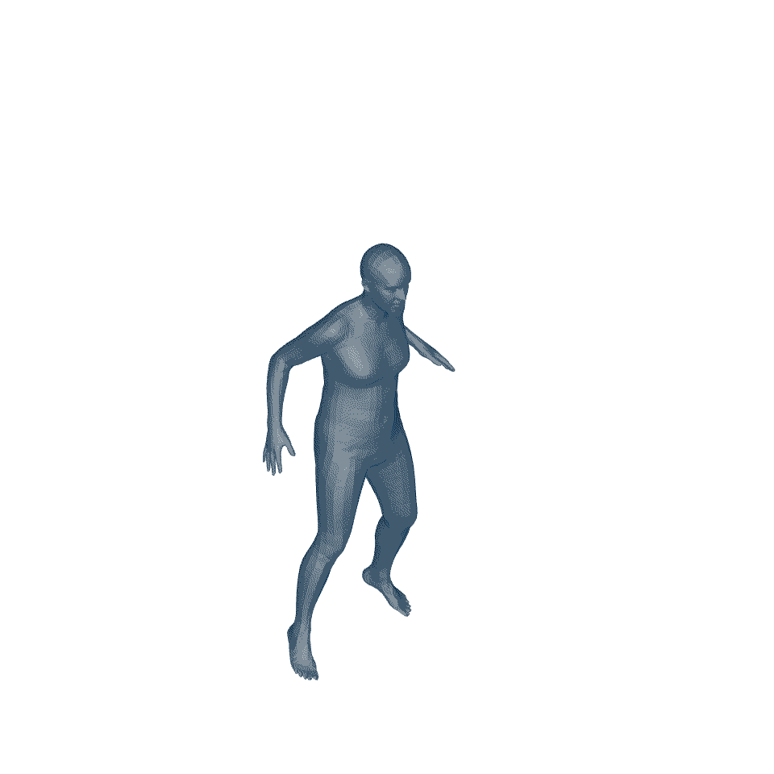

# SkeletonDiffusion - Nonisotropic Gaussian Diffusion for Realistic 3D Human Motion Prediction (CVPR 2025)

---

## ⭐ Official repository: [Ceveloper/SkeletonDiffusion](https://github.com/Ceveloper/SkeletonDiffusion)
👉 Please star & contribute there — this repo is just a mirror.

---

**[Website](https://ceveloper.github.io/publications/skeletondiffusion/)** | 
**[Paper](https://arxiv.org/abs/2501.06035)**   |
**[Video](https://www.youtube.com/watch?v=W9GzdDXN41M)**  | 
**[Demo](https://huggingface.co/spaces/SkeletonDiffusion/SkeletonDiffusion_Demo)**

This is the official repository for the CVPR 2025 paper 
"_Nonisotropic Gaussian Diffusion for Realistic 3D Human Motion Prediction_".  

Authors: 
[Cecilia Curreli](https://ceveloper.github.io/) <sup>1</sup>, 
[Dominik Muhle](https://dominikmuhle.github.io/), 
[Abhishek Saroha](https://cvg.cit.tum.de/members/saroha), 
[Zhenzhang Ye](https://zhenzhang-ye.github.io/), 
[Riccardo Marin](https://ricma.netlify.app/), 
[Daniel Cremers](https://cvg.cit.tum.de/members/cremers), 

<p align="center">
  
</p>


## Intro

We address the task of Probabilistic 3D Human Motion Prediction: from the <b style="color: rgb(128, 143, 154);">past</b>, predict the <b style="color: rgb(46, 108, 157);">future</b>. Here is an example from AMASS:
<table>
    <tr>
        <td></td>
        <td></td>
        <td></td>
        <td></td>
        <td></td>
    </tr>
</table>

Together with the latent diffusion model SkeletonDiffusion, we introduce a training and nonisotropic sampling paradigm for Gaussian denoising diffusion models that lifts the i.i.d. assumption and embeds connections between human body joints into the diffusion process as correlations. 

### Index

- [Intro](#intro)
- [Nonisotropic Gaussian Diffusion plug-and-play](#nonisotropic-gaussian-diffusion)
- [Installation](#installation)
  - [Environment](#1-environment)
  - [Checkpoints](#2-checkpoints)
- [Datasets](#datasets)
  - [AMASS & AMASS-MANO](#amass)
  - [FreeMan](#freeman)
  - [Human3.6M](#human36m)
  - [3D Poses in the Wild](#3d-poses-in-the-wild)
- [Inference](#inference)
- [Evaluation](#evaluation)
- [Training](#training)
  - [Autoencoder](#1-autoencoder)
  - [Diffusion](#2-diffusion)
    - [About Training Time](#about-training-time)
  - [How to Resume Training](#how-to-resume-training)
  - [Running our Implementation as Isotropic](#running-our-implementation-as-isotropic)

## Nonisotropic Gaussian Diffusion - Plug-and-play
In our paper SkeletonDiffusion, nonisotropic diffusion is performed extracting correlations from the adjacency matrix of the human skeleton. If you are working on a problem described by an adjacency matrix or the correlations between components of your problem (for nus human body joints) are available, you can try training your diffusion model with our nonisotropic Gaussian diffusion implementation. 

We build the code for nonisotropic diffusion on top of the reknowed repository of [lucidrains](https://github.com/lucidrains/denoising-diffusion-pytorch). This type of diffusion can be applied to other data beyond latent codes of human motion, with a suitable choice of correlation matrix. Feel free to try it out! For example:

```python
import torch
from src.core.diffusion import NonisotropicGaussianDiffusion, get_cov_from_corr
from src.core.network import Denoiser

num_nodes = 16
if_run_as_isotropic = False # setting this to true runs conventional isotropic diffusion


model = Denoiser(dim=96, cond_dim=0, out_dim=96, channels=num_nodes, num_nodes=num_nodes) #,**diffusion_arch)

rand_matrix = (torch.rand(num_nodes, num_nodes) >= 0.5).float()
correlation_matrix = (rand_matrix + rand_matrix.T) // 2 # has to be simmetric
Sigma_N, Lambda_N, U = get_cov_from_corr(correlation_matrix=correlation_matrix,  if_sigma_n_scale=True, sigma_n_scale='spectral', if_run_as_isotropic=if_run_as_isotropic)            
diffusion = NonisotropicGaussianDiffusion(Sigma_N=Sigma_N, Lambda_N=Lambda_N, U=U, model=model, timesteps=10)
       


training_samples = torch.rand(8, num_nodes, 96)
loss, _, _ = diffusion(training_samples)
loss.mean().backward()

# after a lot of training

generated_samples, _ = diffusion.sample(batch_size = 4)
generated_samples.shape # (4, 16, 96)
```

Or, if you simply want to to use the Trainer class of lucidrain to train a model. In our case, we are working with 1D data so _Trainer1D_ is the right choice.

```python
from denoising_diffusion_pytorch import Trainer1D, Dataset1D

from src.core.diffusion import NonisotropicGaussianDiffusion, get_cov_from_corr
from src.core.network import Denoiser

num_nodes = 16
if_run_as_isotropic = False # setting this to true runs conventional isotropic diffusion


model = Denoiser(dim=96, cond_dim=0, out_dim=96, channels=num_nodes, num_nodes=num_nodes) #,**diffusion_arch)

rand_matrix = (torch.rand(num_nodes, num_nodes) >= 0.5).float()
correlation_matrix = (rand_matrix + rand_matrix.T) // 2 # has to be simmetric
Sigma_N, Lambda_N, U = get_cov_from_corr(correlation_matrix=correlation_matrix,  if_sigma_n_scale=True, sigma_n_scale='spectral', if_run_as_isotropic=if_run_as_isotropic)            
diffusion = NonisotropicGaussianDiffusion(Sigma_N=Sigma_N, Lambda_N=Lambda_N, U=U, model=model, timesteps=10)

training_seq = torch.rand(64, num_nodes, 96) # features are normalized from 0 to 1
dataset = Dataset1D(training_seq)  # this is just an example, but you can formulate your own Dataset and pass it into the `Trainer1D` below

trainer = Trainer1D(
    diffusion,
    dataset = dataset,
    train_batch_size = 32,
    train_lr = 8e-5,
    train_num_steps = 700000,         # total training steps
    gradient_accumulate_every = 2,    # gradient accumulation steps
    ema_decay = 0.995,                # exponential moving average decay
    amp = True,                       # turn on mixed precision
)

trainer.train()
```

## Installation

### 1. Environment

We use conda to create our environments.
```bash
conda create --name skeldiff python=3.10 -y
conda activate skeldiff
conda config --env --add channels pytorch
conda config --env --add channels conda-forge
conda install pytorch==2.0.1 torchvision==0.15.2 cudatoolkit==11.8 -c pytorch -y
# If the previous line installs pytorch cpu only version, substitute with the following:
# pip install torch torchvision torchaudio --index-url https://download.pytorch.org/whl/cu118
conda install numpy=1.25 scikit-image=0.24.0 scipy=1.11.3 pillow=9.4.0 pip ignite=0.4.13 pyyaml=6.0.1 einops=0.7.0  hydra-core=1.3.2 zarr=2.18.0 tensorboard=2.15.0 tabulate=0.9.0 cdflib=1.2.3 ipython=8.16.1 jupyter==1.0.0 tqdm
matplotlib=3.8.0 -c conda-forge -y
pip install denoising-diffusion-pytorch==1.9.4 git+https://github.com/nghorbani/human_body_prior@4c246d8
```

### 2. Checkpoints

Our model checkpoints are stored on [Huggingface](https://huggingface.co/SkeletonDiffusion/ModelCheckpoints). Download them for inference or plug them in our evaluation pipeline by placing them into `./trained_models/`. 


## Datasets

Download the dataset of your choice. Original data should be put in the following directory:

```bash
mkdir datasets/raw
```

The raw dataset will be required to process training eand evaluation data that the scripts will place in `datasets/processed`, but afterwards not anymore.

### [**AMASS**](https://amass.is.tue.mpg.de/)

We follow the same dataset creation pipeline as https://github.com/BarqueroGerman/BeLFusion/tree/main, reported here.

Download the *SMPL+H G* files for **22 datasets**: ACCAD, BMLhandball, BMLmovi, BMLrub, CMU, DanceDB, DFaust, EKUT, EyesJapanDataset, GRAB, HDM05, HUMAN4D, HumanEva, KIT, MoSh, PosePrior (MPI_Limits), SFU, SOMA, SSM, TCDHands, TotalCapture, and Transitions. Then, move the **tar.bz2** files to `./datasets/raw/AMASS` (DO NOT extract them). 

Now, download the 'DMPLs for AMASS' from [here](https://smpl.is.tue.mpg.de), and the 'Extended SMPL+H model' from [here](https://mano.is.tue.mpg.de/). Move both extracted folders (dmpls, smplh) to `./datasets/annotations/AMASS/bodymodels`. Then, run:
```bash
cd src
python -m data.create_amass_dataset --gpu --if_extract_zip
```

Instead, if you already had extracted the dataset zip files into .zarr archives, move them to `./datasets/annotations/AMASS/dataset` and run 
```bash
cd src
python -m data.create_amass_dataset --gpu
```
This script will create  at `./datasets/propcessed/AMASS/hmp/` the files `data_3d_amass.npz` (dataset) and `mean_motion_test.txt` (values required for CMD metrics).

**Note 1**: remove the `--gpu` flag if you do not have a GPU.
**Note 2**: this step could take a while (~1 hours in CPU, ~5-15 minutes in GPU).

#### AMASS-MANO
We provide also code and checkpoints for a model trained also with the additional hands joints (AMASS-MANO). To create the corresponding dataset, run the command again and append the flag `--include_hands`.


### [**FreeMan**](https://huggingface.co/datasets/wjwow/FreeMan)
Register and follow instruction by FreeMan's author to gain access to the data. Place original files in  in `./datasets/raw/FreeMan` and unzip _keypoints3d_.
```bash
cd src
python -m data.create_freeman_dataset --gpu
``` 

### [**Human3.6M**](http://vision.imar.ro/human3.6m/description.php)

Extract the Poses-D3Positions* folders for S1, S5, S6, S7, S8, S9, S11 into `./datasets/raw/Human36M`. Then, run:
```bash
cd src
python -m data.create_h36m_dataset --gpu
```
### [**3D Poses in the Wild**](https://virtualhumans.mpi-inf.mpg.de/3DPW/)
We perform zero-shot inference on 3DPW for models trained on AMASS. Download the original dataset according to the instruction and place it into `./datasets/raw/3DPW`.

```bash
cd src
python -m data.create_3dpw_dataset --gpu
```

## Inference

If you want to perform inference with SkeletonDiffusion on your data (for example poses extracted from RGB), follow our notebook _Inference Example.ipynb_. You can als take as an example our Demo on Huggingface, which uses other models to extract poses from causual videos from YouTube and perform motion prediction on top.

## Evaluation

All models can be evaluated on a 24GB GPU, we use a NVIDIA RTX6000. Evaluation on AMASS takes around 12 minutes.

```bash
conda activate skeldiff
python eval.py dataset=amass checkpoint_path=./trained_models/hmp/amass/diffusion/checkpoints/cvpr_release.pt stats_mode=probabilistic
```
Evaluating with `stats_mode=probabilistic` includes the multimodal GT metrics. Switch to `stats_mode=deterministic` if you want to save time in the evaluation. 

To evaluate on the FreeMan and Human3.6M datasets (ca 8 mins each), you can use the following lines:
```bash
python eval.py dataset=freeman checkpoint_path=./trained_models/hmp/freeman/diffusion/checkpoints/cvpr_release.pt stats_mode=probabilistic
```
```bash
python eval.py dataset=h36m checkpoint_path=./trained_models/hmp/h36m/diffusion/checkpoints/cvpr_release.pt stats_mode=probabilistic
```

We also perform zero-shot on 3D Poses in the wild (3DPW) with the model trained on amass:
```bash
python eval.py dataset=3dpw checkpoint_path=./trained_models/hmp/amass/diffusion/checkpoints/cvpr_release.pt stats_mode=probabilistic
```

## Training

SkeletonDiffusion is a latent diffusion model, so it is trained in two steps.
### 1. Autoencoder

First train the autoencoder to learn a temporally-compressed latent space that retains the notion of joints. We train all autoencoders on 16GB GPUs. 


#### AMASS
```
python train_autoencoder.py dataset=amass model.num_epochs=300 task.pose_box_size=1.2 model.autoenc_arch.enc_num_layers=2 
```
To train a model also with hands joints on _AMASS-MANO_, set `dataset=amass-mano`.
#### FreeMan
```bash
python train_autoencoder.py dataset=freeman model.num_epochs=200
```

#### Human3.6M
```bash
python train_autoencoder.py dataset=h36m model.num_epochs=200
```

### 2. Diffusion

Train our Nonisotropic diffusion on top of the previously trained latent space and autoencoder, you will need a 48GB GPU (A40). 


### About Training Time
The diffusion part of the training is quite slow, due to necessity of encoding and decoding latent embeddings via the recurrent autoencoder. If you want to reduce the training time, you can train less performant models by relaxing the diffusion training objective (See Appendix E.4 and results for AMASS).


|    Model                                     | Training Time (AMASS) |   APD $\uparrow$  |            | CMD $\downarrow$|            | str mean $\downarrow$   | str RMSE $\downarrow$ |
|----------------------------------------------|-----------------------|-------------------|------------|----------------|------------|---------------------|----------|
| k=1                                          | ~1d 7h (<48GB GPU)    | 4.987             |            | 16.574         |            | 3.50                | 4.56     |
| k=50 latent argmin                           | ~1d 14h (<48GB GPU)   | 8.497             |            | 12.885         |            | 3.17                | 4.35     |
| k=50 motion space argmin (SkeletonDiffusion) | ~6d (48GB GPU)        | 9.456             |            | 11.418         |            | 3.15                | 4.45     |


To train the model with _k=1_ (without loss relaxation) append ```model.train_pick_best_sample_among_k=1``` to your training arguments:
```bash
python train_diffusion.py model.train_pick_best_sample_among_k=1 <your training arguments>
```

To train the model by choosing the sample to backpropagate the loss in laten space with k=50 (_k=50 latent argmin_) append ```model.similarity_space=latent_space``` to your training arguments:
```bash
python train_diffusion.py model.similarity_space=latent_space <your training arguments>
``` 

#### AMASS
```bash
python train_diffusion.py model=skeleton_diffusion model.pretrained_autoencoder_path=./output/hmp/amass/autoencoder/<your folder>/checkpoints/<checkpoint name>.pt dataset_folder_log_path=amass model.num_epochs=150 model.lr_scheduler_kwargs.warmup_duration=75
```

For _AMASS-MANO_ set `dataset_folder_log_path=amass-mano` and `model.pretrained_autoencoder_path` to the right checkpoint.
#### FreeMan
```bash
python train_diffusion.py model=skeleton_diffusion model.pretrained_autoencoder_path=./trained_models/hmp/freeman/autoencoder/<your folder>/checkpoints/<checkpoint name>.pt dataset_folder_log_path=freeman model.num_epochs=200  model.lr_scheduler_kwargs.gamma_decay=0.85 model.lr_scheduler_kwargs.warmup_duration=25 model.lr_scheduler_kwargs.update_every=5 
```

#### Human3.6M
```bash
python train_diffusion.py model=skeleton_diffusion model.pretrained_autoencoder_path=./output/hmp/h36m/autoencoder/<your folder>/checkpoints/<checkpoint name>.pt dataset_folder_log_path=h36m model.num_epochs=100 model.diffusion_arch.attn_heads=8  model.lr_scheduler_kwargs.gamma_decay=0.85 model.lr_scheduler_kwargs.warmup_duration=25
```

### How to Resume Training

To resume training from an experiment repository and a saved checkpoint, you can run the corresponding train script and append a few arguments:

```bash
python train_<model>.py if_resume_training=True load=True output_log_path=<path to experiemnt repository> load_path=<path to .pt checkpoint> <your other arguments>
```

For an example checkpoint  _./output/hmp/amass/diffusion/June30_11-35-08/checkpoints/checkpoint_144.pt_, you would run:
```bash
python train_diffusion.py if_resume_training=True load=True output_log_path=<./output/hmp/amass/diffusion/June30_11-35-08 load_path=./output/hmp/amass/diffusion/June30_11-35-08/checkpoints/checkpoint_144.pt <your other training arguments of the previous call>
```

### Running our Implementation as Isotropic

Our Nonisotropic implemetation supports also isotropic diffusion (our _isotropic_ ablations of Table 7.). This may be useful to you if you want to use our codebase for other projects and want to reduce classes/complexity. 

To run our nonisotropic diffusion as isotropic with a suitable choice of covariance matrix:

```bash
python train_diffusion.py model=skeleton_diffusion_run_code_as_isotropic <your training arguments>
```

To run the isotropic diffusion codebase as in BeLFusion or lucidrain:
```bash
python train_diffusion.py model=isotropic_diffusion <your training arguments>
```

For the same random initialization and environment, both trainings return exactly the same weights.
